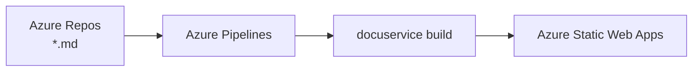

# Getting started

You need Node.js 20 or later and read access to the repository.

## Install

```bash
npm install --global docuservice
```

## Build locally

Point the CLI at the folder that holds your Markdown:

```bash
docuservice build ./docs --out ./site
```

The command writes a complete static site — HTML, CSS, a search index and a
`staticwebapp.config.json` — into `./site`.

## Preview

```bash
docuservice serve ./docs
```

The preview server rebuilds whenever a file changes. See the
[deployment guide](deploying.md) when you are ready to publish.

## How the pieces fit


